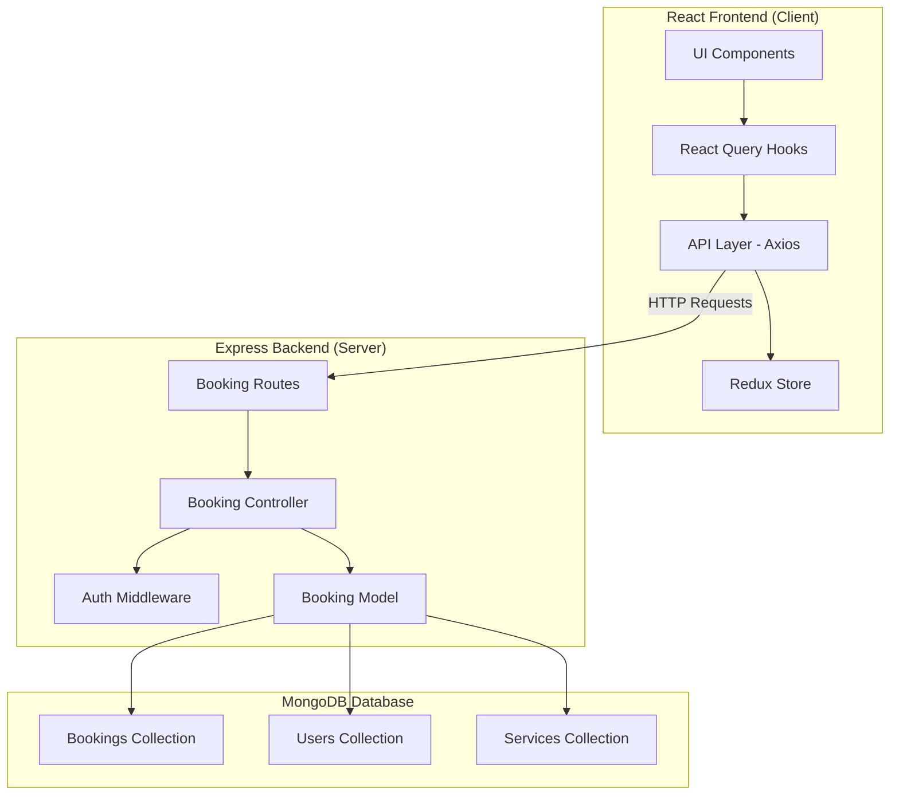
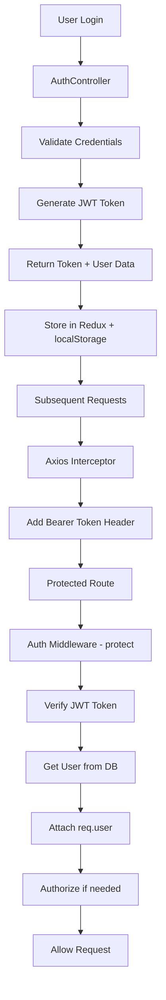
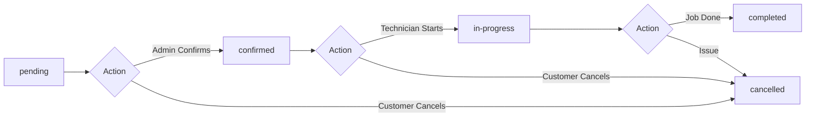
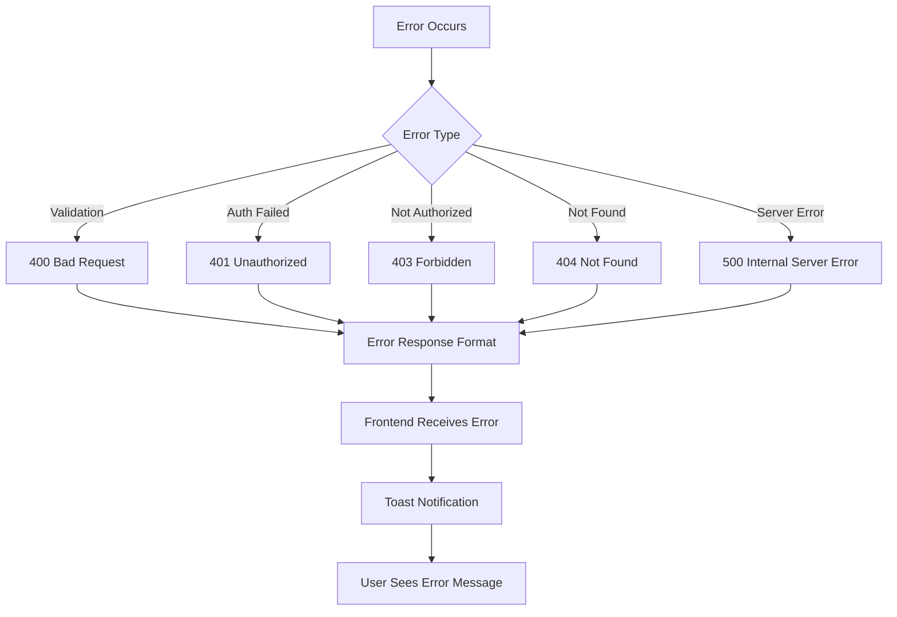
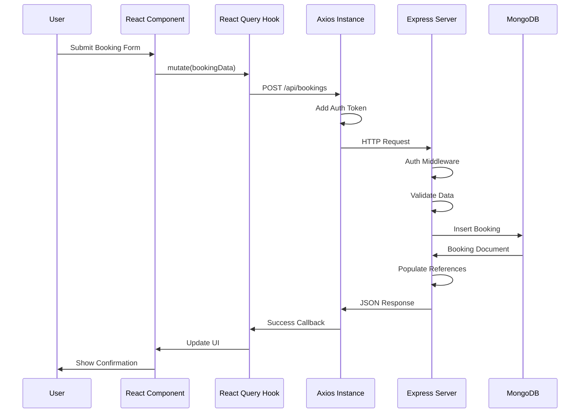
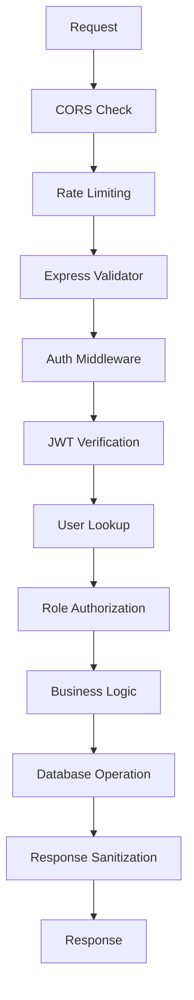
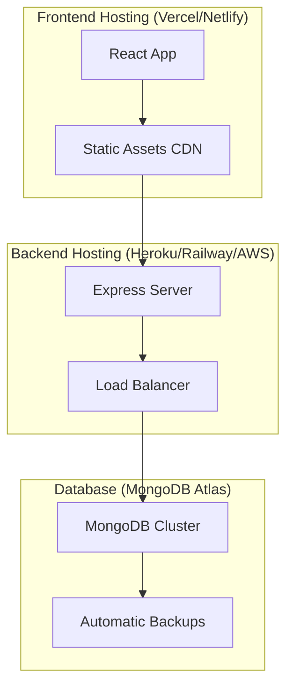

# 🏗️ Booking Module Architecture

## System Architecture Diagram



---

## Data Flow Sequence

### Creating a New Booking

```mermaid
graph LR
    A[User Fills Form] --> B[BookingScreen]
    B --> C[Store in Redux]
    C --> D[SummaryScreen]
    D --> E[OTP Verification]
    E --> F[useCreateBooking Hook]
    F --> G[Axios API Call]
    G --> H[JWT Token Added]
    H --> I[POST /api/bookings]
    I --> J[Auth Middleware]
    J --> K[Booking Controller]
    K --> L[Validate Data]
    L --> M[Fetch Service Details]
    M --> N[Create Booking Doc]
    N --> O[MongoDB]
    O --> P[Return Booking]
    P --> Q[Frontend Success]
    Q --> R[Navigate to Confirmation]
```



---

## Component Architecture

### Frontend Component Tree

```
AppRouter
├── CustomerRoutes
│   ├── HomeScreen
│   │   └── ServiceCard → Navigate to BookingScreen
│   ├── BookingScreen (Multi-step Form)
│   │   ├── Step 1: Customer Details
│   │   ├── Step 2: Address
│   │   ├── Step 3: Date & Time
│   │   └── Step 4: Payment
│   ├── SummaryScreen
│   │   ├── OTPInput
│   │   └── useCreateBooking Hook
│   └── ConfirmationScreen
└── Other Routes...
```

---

## Backend Route Structure

```
/api/bookings
├── POST   /                          createBooking
├── GET    /                          getBookings (Admin)
├── GET    /:id                      getBooking
├── GET    /customer/:customerId     getCustomerBookings
├── GET    /technician/:technicianId getTechnicianBookings
├── PUT    /:id                      updateBooking
├── PATCH  /:id/cancel               cancelBooking
├── PATCH  /:id/confirm              confirmBooking (Admin)
├── PATCH  /:id/complete             completeBooking (Tech/Admin)
└── PATCH  /:id/assign-technician    assignTechnician (Admin)
```

---

## Authentication Flow



---

## Role-Based Access Control Matrix

| Operation | Customer | Technician | Branch Admin | Super Admin |
|-----------|----------|------------|--------------|-------------|
| Create Booking | ✅ Own | ❌ | ❌ | ❌ |
| View Own Bookings | ✅ | ✅ | ✅ | ✅ |
| View All Bookings | ❌ | ❌ | ✅ Branch | ✅ All |
| Update Booking | ✅ Own (pending) | ❌ | ✅ | ✅ |
| Cancel Booking | ✅ Own | ❌ | ✅ | ✅ |
| Confirm Booking | ❌ | ❌ | ✅ | ✅ |
| Complete Booking | ❌ | ✅ Assigned | ✅ | ✅ |
| Assign Technician | ❌ | ❌ | ✅ | ✅ |

---

## Booking Status Workflow



---

## Database Relationships

```mermaid
graph TD
    BOOKING[Booking]
    USER[User]
    SERVICE[Service]
    
    BOOKING -->|customer (ref)| USER
    BOOKING -->|service (ref)| SERVICE
    BOOKING -->|technician (ref)| USER
    
    USER -->|has many| BOOKING
    SERVICE -->|has many| BOOKING
```

---

## State Management

### Redux Store Structure

```javascript
{
  auth: {
    user: { id, name, email, phone, role },
    token: "jwt_token",
    isAuthenticated: true/false
  },
  booking: {
    currentBooking: null,
    bookings: [],
    draftBooking: {
      serviceId: null,
      firstName: '',
      lastName: '',
      email: '',
      phone: '',
      address: '',
      city: '',
      pincode: '',
      date: null,
      timeSlot: '',
      notes: '',
      paymentMethod: 'cash'
    },
    otpSent: false,
    otpVerified: false
  }
}
```

---

## React Query Cache Structure

```javascript
Query Cache:
{
  ['bookings', { status: 'pending', page: 1 }]: [...],
  ['booking', 'BOOKING_ID']: {...},
  ['customerBookings', 'USER_ID', { status: 'confirmed' }]: [...],
  ['technicianBookings', 'TECH_ID', { date: '2024-01-15' }]: [...]
}
```

---

## Error Handling Chain



---

## API Request/Response Cycle



---

## Security Layers



---

## File Organization

```
Appliance Management/
├── Client/
│   └── src/
│       ├── api/
│       │   └── bookings.api.js
│       ├── queries/
│       │   └── useBookings.js
│       └── apps/
│           └── customer/
│               └── screens/
│                   ├── BookingScreen.jsx
│                   ├── SummaryScreen.jsx
│                   └── ConfirmationScreen.jsx
│
└── Server/
    ├── controllers/
    │   └── bookingController.js
    ├── routes/
    │   └── bookingRoutes.js
    ├── models/
    │   └── Booking.js
    └── middleware/
        └── auth.js
```

---

## Deployment Architecture



---

## Monitoring Points

- **API Response Time**: Target < 200ms
- **Database Query Time**: Target < 100ms
- **Error Rate**: Target < 1%
- **Concurrent Users**: Support 100+ users
- **Booking Creation Success Rate**: Target > 99%

---

**Architecture Documentation Complete! 🎯**
